# Partcast — Agent Flow Diagrams

Each diagram below maps one of Partcast's three Phase 1 agents as a Mermaid flowchart. The diagrams use five sections in consistent order: **Trigger** → **Reasoning Chain** → **Decision Logic** → **Human Handoff** → **Learning Loop**. Decision diamonds represent explicit if/then branches from the spec. Stadium shapes represent terminal states or outputs. Circles represent entry points.

---

## Agent 1: AD Compliance Demand Agent

```mermaid
flowchart TD

    subgraph TRG1["TRIGGER"]
        A1T1(("New AD published<br/>to FAA or EASA feed"))
        A1T2(("Existing AD compliance<br/>deadline updated"))
    end

    subgraph RC1["REASONING CHAIN"]
        A1S1["Step 1 — Parse AD document<br/>Extract: affected aircraft types and variants,<br/>affected part numbers and roles,<br/>compliance deadline type: hard time / on-condition / out-of-phase,<br/>compliance threshold in flight hours or calendar date,<br/>approved alternative parts if any"]
        A1CE{"All fields extracted<br/>with confidence ≥ 0.7?"}
        A1HALT(["HALT<br/>Queue unresolved fields for planner review<br/>Agent does not proceed to Step 2"])
        A1S2["Step 2 — Identify in-scope tail numbers<br/>Apply three sequential filters:<br/>aircraft type match → modification status match → operator assignment match<br/>Flag tails with modification status unconfirmed or last updated 30+ days ago"]
        A1S3["Step 3 — Calculate time-to-compliance per tail<br/>Formula: threshold hrs − current hrs ÷ daily utilization rate<br/>Or: compliance calendar date − today<br/>Use more restrictive constraint<br/>Flag tails with utilization data more than 7 days stale"]
        A1S4["Step 4 — Assess inventory and procurement position<br/>Query per affected part number:<br/>certified on-hand serialized units,<br/>confirmed PO deliveries within compliance window,<br/>confirmed supplier lead time in days"]
        A1S5["Step 5 — Calculate demand gap per tail<br/>Gap = units required across all in-scope tails<br/>minus units available within procurement window<br/>Positive gap = shortfall requiring procurement action<br/>Output broken out per tail"]
        A1S6["Step 6 — Assign confidence level<br/>HIGH: hard-time AD · all mod statuses confirmed and current ·<br/>utilization data under 7 days stale · confirmed vendor lead time ·<br/>no unmapped approved alternative parts<br/>MEDIUM: utilization 7–30 days stale · lead time is an estimate ·<br/>on-condition AD with inspection sample under 10 events<br/>LOW: unresolved mod status on any tail · utilization 30+ days stale ·<br/>unmapped alternative parts · ambiguous compliance deadline type"]
    end

    subgraph DL1["DECISION LOGIC"]
        A1DC{"Confidence level?"}
        A1DGH{"Demand gap > 0?"}
        A1DGM{"Demand gap > 0?"}
        A1DM{"Time-to-compliance<br/>less than 2× supplier lead time?"}
        A1OH["URGENT — Full recommendation generated<br/>AI quantity = demand gap from Step 5<br/>All signals pre-populated in Signal Evidence panel<br/>No advisory flags — planner may approve immediately"]
        A1OM["URGENT — Recommendation generated<br/>Amber Data Gaps subsection in Signal Evidence panel<br/>Advisory above action bar: Review flagged gaps before approving<br/>Planner options: Approve · Override · Flag gap for resolution"]
        A1OW(["Watch Item — Exceptions panel<br/>Status: Narrow Margin<br/>Note: procurement window closes in N days<br/>Auto-resolves when compliance deadline passes"])
        A1ON(["No action required<br/>Coverage adequate with sufficient margin"])
        A1OL["Draft — Status: Requires Planner Input<br/>Status badge: Input Required in red<br/>Red callout box above signal list:<br/>unresolved questions listed explicitly<br/>Approve button replaced by Resolve Data Gaps<br/>On resolution: re-runs Steps 5–6 and re-enters decision logic"]
    end

    subgraph HH1["HUMAN HANDOFF — Screen 2"]
        A1HH["Planner opens recommendation on Screen 2<br/>Part header: lead time shown in red if it exceeds days to compliance<br/>Signal Evidence: AD number and title as top signal entry<br/>Per-tail sub-entries collapsed by default — expand to show calculation<br/>Confidence Medium: amber Data Gaps subsection below signal list<br/>Confidence Low: red unresolved questions callout above entire signal list<br/>Inventory Risk: stocking scenarios anchored to compliance deadline date"]
        A1HD{"Planner decision"}
        A1AP(["Approve — AI recommended quantity accepted"])
        A1OVR(["Override — revised quantity with documented rationale"])
        A1FLG(["Flag data gap for resolution<br/>Status: Pending — Data Verification<br/>Held until gap resolved · then re-runs Steps 5–6"])
    end

    subgraph LL1["LEARNING LOOP"]
        A1LL["At compliance deadline — record actuals:<br/>Units actually consumed per affected part per tail<br/>Joined back to original recommendation record<br/>Signal 1 — Decision record: agent qty · approved qty · override reason category<br/>Signal 2 — Accuracy outcome: AI qty vs approved qty vs actuals → FVA event<br/>Signal 3 — Utilization rate error per tail → feeds per-tail rate estimation model<br/>Recalibrate confidence thresholds on rolling 90-day basis<br/>Surfaces in FVA and Accuracy Dashboard, Screen 4"]
    end

    A1T1 --> A1S1
    A1T2 --> A1S1
    A1S1 --> A1CE
    A1CE -- "Yes" --> A1S2
    A1CE -- "No — unresolved fields" --> A1HALT
    A1S2 --> A1S3
    A1S3 --> A1S4
    A1S4 --> A1S5
    A1S5 --> A1S6
    A1S6 --> A1DC
    A1DC -- "Low" --> A1OL
    A1DC -- "High" --> A1DGH
    A1DC -- "Medium" --> A1DGM
    A1DGH -- "Yes" --> A1OH
    A1DGH -- "No" --> A1DM
    A1DGM -- "Yes" --> A1OM
    A1DGM -- "No" --> A1DM
    A1DM -- "Yes — narrow margin" --> A1OW
    A1DM -- "No — adequate margin" --> A1ON
    A1OH --> A1HH
    A1OM --> A1HH
    A1OL --> A1HH
    A1HH --> A1HD
    A1HD -- "Approve" --> A1AP
    A1HD -- "Override" --> A1OVR
    A1HD -- "Flag gap" --> A1FLG
    A1AP --> A1LL
    A1OVR --> A1LL
    A1FLG --> A1LL
```

---

## Agent 2: AOG Risk Scoring Agent

```mermaid
flowchart TD

    subgraph TRG2["TRIGGER"]
        A2TC(("Scheduled cadence<br/>Default: every 6 hours<br/>Configurable per operator<br/>Full fleet re-score"))
        A2TR1(("Real-time: unscheduled<br/>removal event logged"))
        A2TR2(("Real-time: supplier updates<br/>delivery date on open PO"))
        A2TR3(("Real-time: flight schedule change<br/>affects tail utilization by 15%+<br/>over next 30 days"))
        A2TR4(("Real-time: demand recommendation<br/>approved or overridden for a part<br/>linked to an in-scope maintenance event"))
    end

    subgraph RC2["REASONING CHAIN"]
        A2S1["Step 1 — Assemble maintenance event horizon per tail<br/>Pull all scheduled checks, AD compliance deadlines,<br/>and life-limited part replacements within next 180 days<br/>Sources: maintenance calendar · Agent 1 AD records · ERP life-limited register<br/>Events beyond 180 days held in lookahead buffer only"]
        A2S2["Step 2 — Cross-reference parts against inventory and in-transit stock<br/>For each tail–event–part tuple:<br/>certified on-hand units at designated maintenance facility,<br/>units in transit on confirmed POs due before event date,<br/>existing demand recommendations: use approved qty if approved,<br/>AI-recommended qty if still pending"]
        A2S3["Step 3 — Calculate coverage ratio and flag gaps<br/>Coverage ratio = units available within event window ÷ units required<br/>Below 1.0: flagged as coverage gap — carried forward to Step 4<br/>1.0 to 1.2: flagged as thin coverage — noted separately"]
        A2S4["Step 4 — Weight gaps by AOG consequence<br/>Proximity weight: within 30 days = 3.0 · 31–60 days = 2.0 ·<br/>61–90 days = 1.5 · beyond 90 days = 1.0<br/>Consequence weight: normalized financial AOG exposure from contract SLA<br/>Weighted gap score = shortfall units × proximity weight × consequence weight"]
        A2S5["Step 5 — Aggregate to tail-level AOG Risk Score 0–100<br/>Parts coverage gap: 0–60 pts — heaviest component<br/>Time proximity to nearest check: 0–20 pts — max at 14 days out<br/>Supplier lead time vs time available: 0–10 pts — max when lead time equals window<br/>Historical unscheduled removal rate for this airframe type: 0–10 pts"]
        A2S6["Step 6 — Detect fast-moving risk<br/>Compare current score to previous run score<br/>Flag if delta exceeds 15 points in a single cycle<br/>regardless of absolute score level"]
        A2FM{"Score delta<br/>> 15 points?"}
        A2FMSET["Fast-Moving Risk flag ACTIVE<br/>Watch: tail promoted to top of Exceptions panel<br/>Alert or Critical: Risk Acceleration signal entry<br/>appended to recommendation in Signal Evidence panel"]
        A2FMCLR["No fast-moving flag"]
    end

    subgraph DL2["DECISION LOGIC"]
        A2BAND{"AOG Risk Score<br/>band?"}
        A2NRM(["Score 0–40: Normal<br/>Log score to history<br/>No action · tail not shown in Exceptions panel<br/>Score accessible in tail detail view"])
        A2WCH["Score 41–65: Watch<br/>Tail appears in Exceptions panel on Screen 1<br/>Watch badge with current score and trend arrow<br/>No demand recommendation generated automatically<br/>Fast-moving flag: tail promoted to top of Exceptions panel"]
        A2ALT["Score 66–85: Alert<br/>Demand recommendation generated for parts driving score elevation<br/>Priority: High — placed in review queue<br/>Signal Change chip: AOG Risk: Alert in red<br/>AOG Risk Score badge displayed on part header in Screen 2<br/>In-app notification sent to planner via bell icon<br/>Fast-moving flag: notification shown at higher visual weight"]
        A2CRT["Score 86–100: Critical<br/>Demand recommendation generated — Priority: Urgent<br/>Escalation record sent to S&OP Leader role in addition to planner<br/>Item added to S&OP review queue with Critical AOG Risk tag<br/>Procurement window countdown shown in action bar on Screen 2<br/>Approve button relabeled: Approve — Time Sensitive<br/>Fast-moving flag: Risk Acceleration signal entry appended"]
    end

    subgraph HH2["HUMAN HANDOFF — Screen 2 — Critical Status"]
        A2HH["Planner opens Critical recommendation on Screen 2<br/>Part header: large red AOG Risk Score badge after part description<br/>Full-width critical alert banner between part header and forecast charts:<br/>plain-language AOG summary — tail · check proximity · parts needed ·<br/>on-hand units · confirmed lead time · procurement window deadline<br/>Forecast comparison panel present but reduced in height<br/>Signal Evidence: AOG score breakdown as first entry showing four<br/>component contributions, followed by individual signal entries<br/>Inventory Risk: time-anchored scenarios — order today · order in 3 days ·<br/>order after window closes<br/>Action bar: countdown in red showing days until procurement window closes"]
        A2HD{"Planner decision"}
        A2AP(["Approve — Time Sensitive<br/>AI recommended quantity accepted"])
        A2OVR(["Override with rationale"])
        A2ESC(["Escalate to S&OP<br/>Inline popover captures optional note"])
    end

    subgraph LL2["LEARNING LOOP"]
        A2LL["After each maintenance event or compliance deadline — retrospective:<br/>False negative: AOG occurred on tail scored below 65 in prior 30 days<br/>Log: which signal was absent or underweighted<br/>Accumulate into signal quality review report — surfaced quarterly<br/>True positive: tail scored above 85 · planner acted · AOG avoided<br/>Log: signal weights active at recommendation time<br/>Reinforce weights by small incremental factor on rolling 90-day average<br/>Score calibration drift: if distribution clusters at extremes,<br/>flag for data scientist or system administrator review —<br/>weights are not auto-adjusted"]
    end

    A2TC --> A2S1
    A2TR1 --> A2S1
    A2TR2 --> A2S1
    A2TR3 --> A2S1
    A2TR4 --> A2S1
    A2S1 --> A2S2
    A2S2 --> A2S3
    A2S3 --> A2S4
    A2S4 --> A2S5
    A2S5 --> A2S6
    A2S6 --> A2FM
    A2FM -- "Yes" --> A2FMSET
    A2FM -- "No" --> A2FMCLR
    A2FMSET --> A2BAND
    A2FMCLR --> A2BAND
    A2BAND -- "0–40" --> A2NRM
    A2BAND -- "41–65" --> A2WCH
    A2BAND -- "66–85" --> A2ALT
    A2BAND -- "86–100" --> A2CRT
    A2CRT --> A2HH
    A2ALT --> A2HH
    A2HH --> A2HD
    A2HD -- "Approve" --> A2AP
    A2HD -- "Override" --> A2OVR
    A2HD -- "Escalate" --> A2ESC
    A2AP --> A2LL
    A2OVR --> A2LL
    A2ESC --> A2LL
    A2NRM --> A2LL
    A2WCH --> A2LL
```

---

## Agent 3: S&OP Package Agent

```mermaid
flowchart TD

    subgraph TRG3["TRIGGER"]
        A3TS(("Scheduled: 48 hours before<br/>S&OP meeting date<br/>configured in system calendar"))
        A3TM(("Manual trigger by<br/>S&OP Leader role<br/>Regenerates full package"))
    end

    subgraph RC3["REASONING CHAIN"]
        A3S1["Step 1 — Compute actuals variance vs approved consensus plan<br/>Pull approved demand quantities for closing cycle<br/>Join against ERP actuals consumption for same period and parts<br/>Variance = approved qty − actual qty per part number<br/>Calculate in both units and inventory value<br/>Group by: part category · demand event type"]
        A3S2["Step 2 — Classify root cause of material variances<br/>Materiality threshold: unit variance > 10% of approved qty<br/>OR value variance > 50,000 USD — both configurable per operator<br/>Four mutually exclusive root cause categories:<br/>Model error: AI recommendation was wrong before override<br/>Override error: planner override moved forecast in wrong direction<br/>External shock: material signal arrived after cycle freeze date<br/>Data gap: relevant signal not in system at planning time<br/>Assign primary root cause · note secondary factors"]
        A3S3["Step 3 — Summarize top AOG risk items requiring decisions<br/>Pull tails in Alert 66–85 or Critical 86–100 from Agent 2 latest run<br/>For each: summarize demand recommendation status and time remaining<br/>Exclude items with approved recommendation and supply action in progress<br/>Produce ranked list of up to 5 items — Critical first, then by window countdown"]
        A3S4["Step 4 — Calculate period FVA metrics<br/>AI forecast accuracy: MAPE vs actuals before override — full cycle + by event type<br/>Override accuracy: MAPE for overridden items vs actuals<br/>Cases where AI outperformed override: percentage of overridden items<br/>Override attribution rate: percentage of overrides with documented structured rationale<br/>Bias direction by category: systematic over- or under-forecasting per event type<br/>Output populates Screen 4 FVA and Accuracy Dashboard for closed cycle"]
        A3S5["Step 5 — Assess supply matching coverage for opening cycle<br/>Cross-reference approved opening cycle demand plan<br/>against on-hand inventory, confirmed POs, approved repositioning<br/>Coverage states: Fully covered · Partially covered · Uncovered<br/>Calculate total inventory value at risk from uncovered items<br/>Identify top 5 uncovered demand items by value"]
        A3S6["Step 6 — Synthesize S&OP package<br/>Section 1 — Actuals Review: variance table · root cause · FVA metrics<br/>Distinguish process failures from unavoidable variances<br/>Section 2 — Risk Review: AOG risk items · uncovered demand items<br/>Each item has recommended action and deadline<br/>Section 3 — Forward Plan: opening cycle demand plan ·<br/>items still pending or requiring planner input ·<br/>new Agent 1 or Agent 2 recommendations since last cycle"]
        A3PC{"Package<br/>classification"}
    end

    subgraph DL3["DECISION LOGIC"]
        A3GRN["Package status: GREEN<br/>No material variances · no Critical AOG items ·<br/>opening cycle coverage above 90%<br/>Actuals Review: brief summary table<br/>Meeting agenda can focus on Forward Plan"]
        A3AMB_EXT["Package status: AMBER at most<br/>Variance root cause: External shock<br/>Actuals Review flags variance for awareness<br/>Framed as external event — not a process failure<br/>External shock items excluded from FVA accuracy calculation<br/>No process review escalation triggered"]
        A3AMB_PROC["Package status: AMBER at minimum<br/>Variance root cause: Model error or Override error<br/>Actuals Review includes process review flag callout box<br/>Identifies pattern with FVA data cited as evidence<br/>Flag does not assign blame — surfaces pattern for team discussion<br/>S&OP Leader can annotate with meeting decision"]
        A3RED["Package status: RED<br/>Any item in Critical AOG risk status<br/>Critical item placed at top of Risk Review section<br/>Full-width red alert banner with recommended decision and deadline<br/>Package cannot be marked Closed until S&OP Leader<br/>records explicit decision on every Critical item"]
        A3COV["Supply coverage below 80%<br/>Forces package status to RED regardless of variance root cause<br/>Uncovered demand items surfaced prominently in Risk Review"]
    end

    subgraph HH3["HUMAN HANDOFF — S&OP Package"]
        A3HH["S&OP Leader opens package from notification or S&OP queue on Screen 1<br/>Package opens to one-page executive summary:<br/>1 — Package status badge GREEN / AMBER / RED — most prominent element<br/>2 — Two-sentence plain-language headline: what happened · what decisions are needed<br/>3 — Four stat cards: FVA headline · AOG risk items count ·<br/>top variance amount and root cause · opening cycle coverage percentage<br/>4 — Three section tiles: Actuals Review · Risk Review · Forward Plan<br/>Each tile shows status and count of items requiring decisions<br/>Package is a live document — not a PDF<br/>Each Risk Review and Forward Plan item has annotation field and Record Decision button<br/>Decision options: Approve · Modify · Defer with owner assignment"]
        A3HLD{"S&OP Leader<br/>records decisions"}
        A3CLOSE(["Mark package Closed<br/>All required decisions recorded<br/>Triggers next planning cycle to open"])
    end

    subgraph LL3["LEARNING LOOP"]
        A3LL["After S&OP Leader marks package Closed:<br/>Record disposition of each recommended action:<br/>Approved as recommended · Modified · Rejected with reason<br/>Signal 1 — Materiality threshold calibration:<br/>if S&OP Leader repeatedly dismisses flagged variances,<br/>agent surfaces threshold adjustment recommendation to system administrator<br/>Threshold is not auto-adjusted — requires explicit configuration change<br/>Signal 2 — Root cause attribution accuracy:<br/>if Leader decision notes contradict agent classification,<br/>log as attribution error — reviewed by data scientist for pattern analysis<br/>Signal 3 — Package utility score:<br/>single-question rating: Yes / Partially / No<br/>free-text field if Partially or No — reviewed by product team"]
    end

    A3TS --> A3S1
    A3TM --> A3S1
    A3S1 --> A3S2
    A3S2 --> A3S3
    A3S3 --> A3S4
    A3S4 --> A3S5
    A3S5 --> A3S6
    A3S6 --> A3PC
    A3PC -- "No material variances<br/>No Critical AOG<br/>Coverage above 90%" --> A3GRN
    A3PC -- "Variances exist<br/>Root cause: External shock<br/>or Data gap" --> A3AMB_EXT
    A3PC -- "Variances exist<br/>Root cause: Model error<br/>or Override error" --> A3AMB_PROC
    A3PC -- "Any Critical<br/>AOG risk item" --> A3RED
    A3PC -- "Opening cycle<br/>coverage below 80%" --> A3COV
    A3GRN --> A3HH
    A3AMB_EXT --> A3HH
    A3AMB_PROC --> A3HH
    A3RED --> A3HH
    A3COV --> A3HH
    A3HH --> A3HLD
    A3HLD -- "All decisions recorded" --> A3CLOSE
    A3CLOSE --> A3LL
```

